# PM98

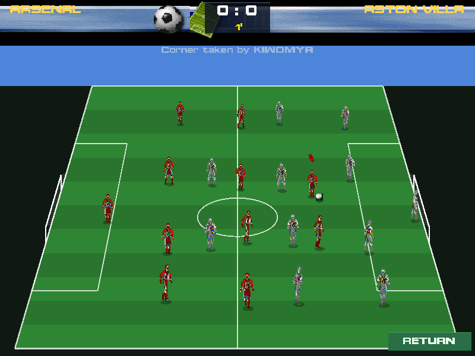

An Android remake of **Premier Manager 98**, rebuilt from the original game's own
data. Take over a club, build your squad, run the season.

> **Early build, now playable.** Pick a club and play a career week-by-week with
> save/load, line-up and tactics, and a transfer market, alongside the original
> management screens rebuilt pixel-for-pixel from the game's own art.

The match view above is a real capture from the running build: the original game's own
DATSIM player sprites on a 3/4 broadcast pitch, driven by the reverse-engineered match engine
(see the reverse-engineering notes in `docs/re/`). Original game art © Dinamic Multimedia;
shown here for this non-commercial fan remake.

## Download

📦 **[Download the latest APK](https://github.com/Matswm86/pm98-android/releases/download/latest/pm98.apk)**
&nbsp;·&nbsp; [all releases](https://github.com/Matswm86/pm98-android/releases)

Open the link on your phone, tap the APK, allow "install from this source" if
prompted. Reinstalling over an older build? Uninstall the old one first.

## What's in it now

- The full English pyramid: Premier League + Divisions One, Two and Three
  (92 clubs), as the original 1997-98 database has them.
- 384 more clubs from leagues across Europe and South America.
- ~8,000 players with their original ratings, keepers and squads as shipped.
- Browse League → Club → Squad → Player, with each player's attributes.
- Simulate a full season from any English division: every fixture played from the
  real squads, with a final table (form, goal difference, promotion/relegation).
- **Play a career:** take over a club and go week-by-week, with autosave/load,
  the league standings, fixtures and your board objective.
- **Team selection & tactics:** choose your XI on the pitch, pick a formation,
  marking and set-piece takers, all fed into the match engine.
- **Transfer market:** buy and sell players (valued from their real ratings),
  with AI clubs bidding back.
- **Injuries & suspensions:** your players pick up knocks and bookings as they
  play, sit out while they recover, and come back. An injured or suspended player
  can't be selected, so the XI reshuffles and the side is weaker until he returns.
  Five bookings earn a one-match ban; reds sit a player down on the spot.
- **Club news:** a live feed of injuries, suspensions, returns to fitness and the
  weekly result, newest first and colour-coded, on the original Main Menu's NEWS.
- **Training & player development:** your players improve or decline over a season
  by age (youngsters climb, veterans fade), and training **intensity** is the lever:
  harder training develops them faster but risks more injuries. Squads age a year
  each season, so a career has a real arc.
- **The youth team:** an academy of young prospects develops on its own track, each with
  a projected **potential** (the ceiling he can reach). When the youth manager judges one
  ready, he's flagged on the YOUTH TEAM screen and you **promote** him into the first-team
  squad. A fresh crop is scouted in every season; youngsters who never make the grade move
  on. Reached from the SQUAD screen's YOUTH TEAM button.
- **The backroom staff:** hire and sack a **TRAINER** (speeds player development), a
  **PHYSIOTHERAPIST** (cuts injury risk) and a **YOUTH COACH** (improves the academy) from
  a pool of available staff, each with a quality rating and a wage. The wage bill comes out
  of the bank every week, and the STAFF screen shows the live effect of your team on all
  three systems. On the Main Menu's EMPLE (staff) icon.
- **The domestic cups:** the **F.A. Cup** and the **Coca-Cola (League) Cup** both run
  alongside the league, with a fresh open draw each round (as the real cups do) and
  prize money for every round you survive plus a bonus for lifting one. The F.A. Cup is
  single-leg with replays then penalties (Round 4 → Round 5 → Qtr. Finals → Semifinals →
  Final); the League Cup is **two-legged** (home and away, settled on aggregate then
  penalties) with a single-leg final (Round 1 → Round 2 → Qtr Finals → Semifinals →
  Final). Track each run on its own original cup screen, around the game's own trophy art.
- **The Charity Shield:** each new season opens with the curtain-raiser between last
  season's **league champions** and **F.A. Cup winners** (the league runners-up step up if
  one club did the Double), a single neutral-venue match settled on penalties if level,
  around the game's own Charity Shield art.
- **European competitions:** finish high and you qualify for Europe the next season,
  the same way the original does: the **European Cup** (champions), the **U.E.F.A. Cup**
  (runners-up) and the **Cup Winners' Cup** (F.A. Cup winners). Each is a two-legged
  knockout (home and away, settled on aggregate then penalties) against a field of strong
  foreign clubs from the game's own database, with prize money on the reversed **UEFA
  schedule** (1M to compete, 510k a win, bonuses for reaching the last 8 and last 4), and
  its own original trophy. Watch every competition through to its final even when you're
  not in it.
- **The winners-of-winners finals:** each new season also opens the **European Supercup**
  (last season's European Cup winners v Cup Winners' Cup winners) and the **Intercontinental
  Cup** (European Cup winners v the South American champions), one-off matches around their
  own original trophies.
- **Watch a match:** a minute-by-minute commentary feed (goals, cards, saves,
  corners) using the original game's own English match text, with real scorers.
- **Club finances:** income and expenses over a 52-week season, structured on the
  original game's finance ledger (tickets, TV, sponsors, wages).
- **The original screens, rebuilt:** the Title / front-door menu, the Main Menu hub,
  League Tables, Line-Up, Squad, Finances, Transfer Market, the Board of Directors and
  the Stadium are reconstructed at the exact pixel coordinates reversed out of the
  game's executable, using its own icons, fonts and backgrounds (see `docs/re/`). The
  app opens on the real PREMIER MANAGER 98 title screen. Runs in landscape, scaled to
  fit any phone.

## Screenshots

> Re-rendered 2026-06-16 at the game's native 4:3 (640×480) — full screen, nothing cut off.

The app, opening on the original PREMIER MANAGER 98 title, captured from the running game
(not a mock-up):

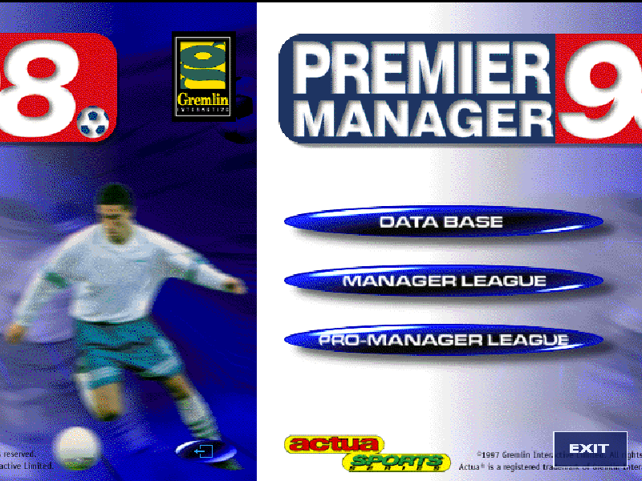

The Title and the original Main Menu as the live career hub (here managing ARSENAL),
captured from the actual Godot build:

  
  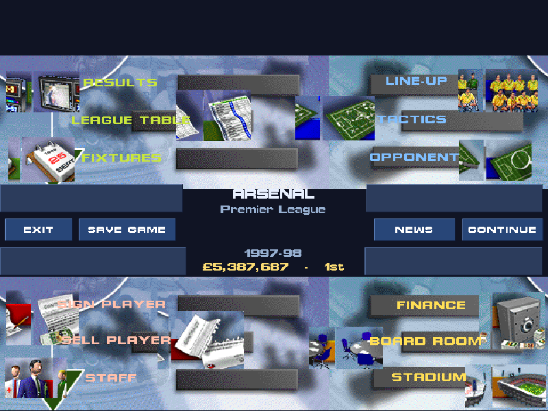

The **2D match view** — the iconic DATSIM sprite match — with the original game's own
player sprites on a 3/4 broadcast pitch, driven by the reverse-engineered match engine
(real scoreline, minute-by-minute events). Captured from the running Godot build:

  
  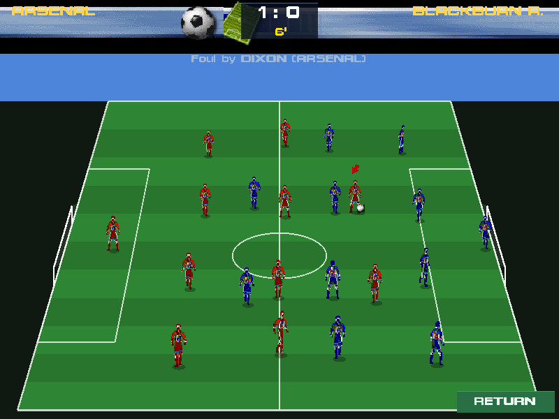

**Injuries, suspensions and the club news feed** — the squad screen flags who's out
(INJ/SUS, in red/orange), and the Main Menu's NEWS carries the week's injuries, bans,
returns and results, colour-coded and newest-first. Captured from the running build:

  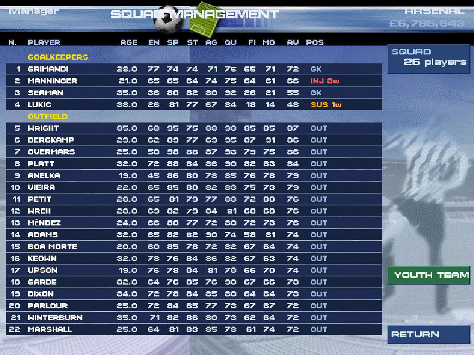
  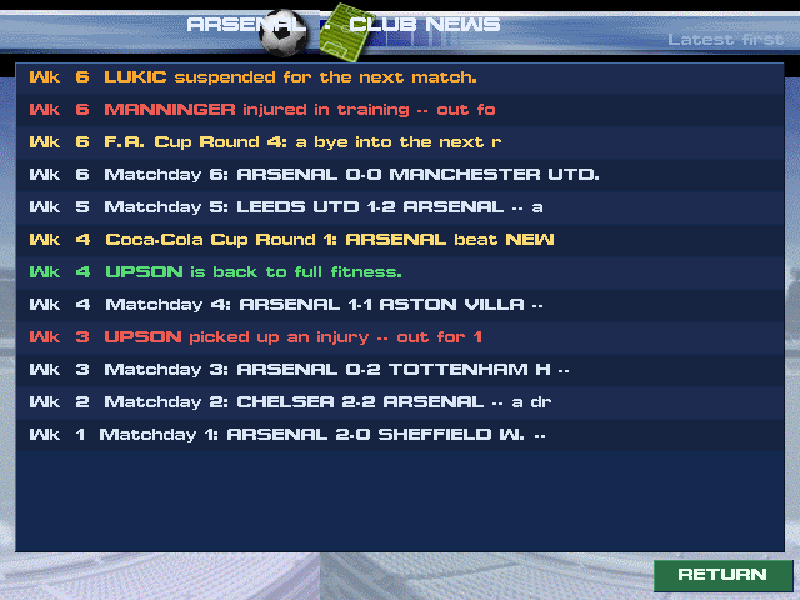

**Training & player development** — set the training intensity and watch your squad's
development trend (young players improving in green, veterans fading), on the Main Menu's
staff icon. Captured from the running build:

  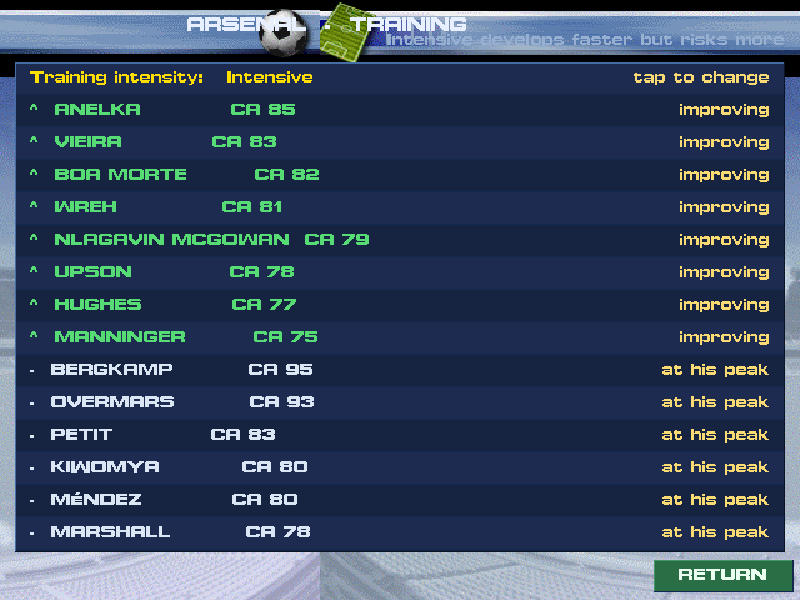

**The youth team** — the academy crop with each prospect's current ability and a projected
potential (star ceiling); the youth manager flags the ones READY for the first team, and a
tap promotes them. Reached from the SQUAD screen's YOUTH TEAM button. Captured from the
running build:

  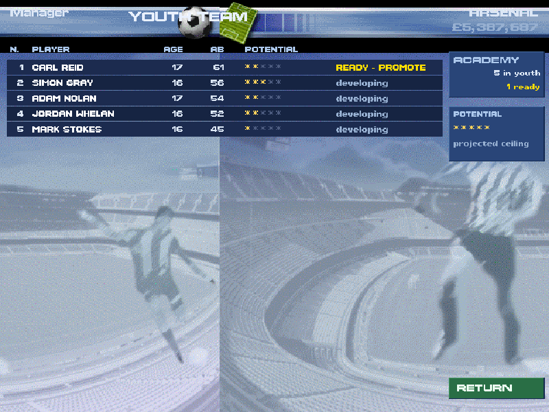

**The backroom staff** — hire a trainer, physio and youth coach (each with a quality and a
wage) from the available pool; the wage bill is drawn from the bank weekly and the screen
shows their live effect on development, injuries and the academy. On the EMPLE icon:

  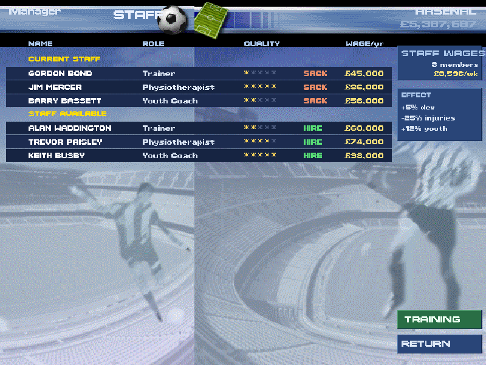

**Contracts & wages** — RENEW is a negotiation now: each player has a wage he wants, and he
can reject your offer. Hold his current terms, meet his demand or better it; an unrenewed deal
runs out and he leaves on a free, unless you set him to auto-renew. Signings and raises move a
live weekly wage bill. Captured from the running build:

  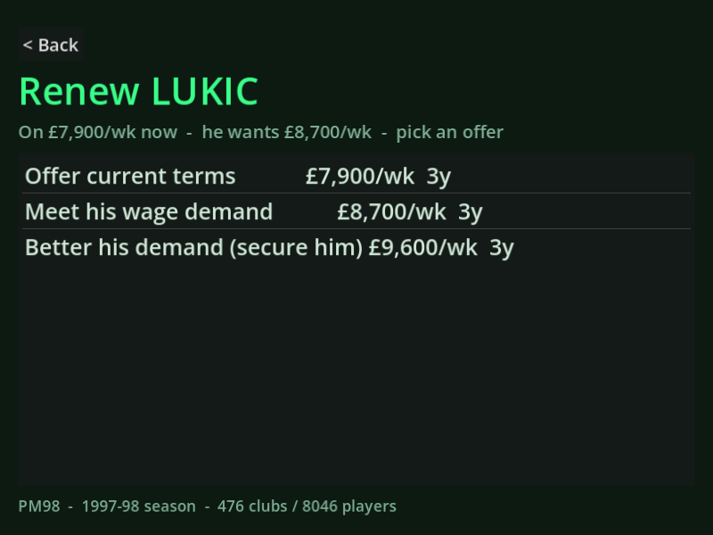

**The domestic cups** — the F.A. Cup (single-leg, replays then penalties) and the
Coca-Cola Cup (two-legged, settled on aggregate), each on its own original cup screen with
the game's own trophy: the manager's run round-by-round, the latest draw, and the status.
Captured from the running build:

  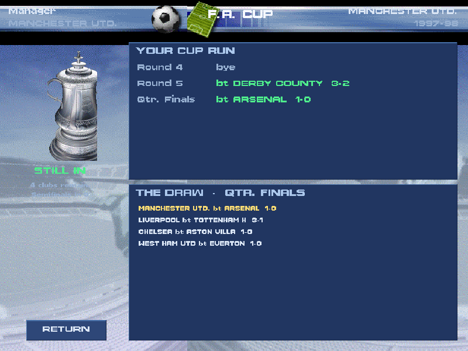
  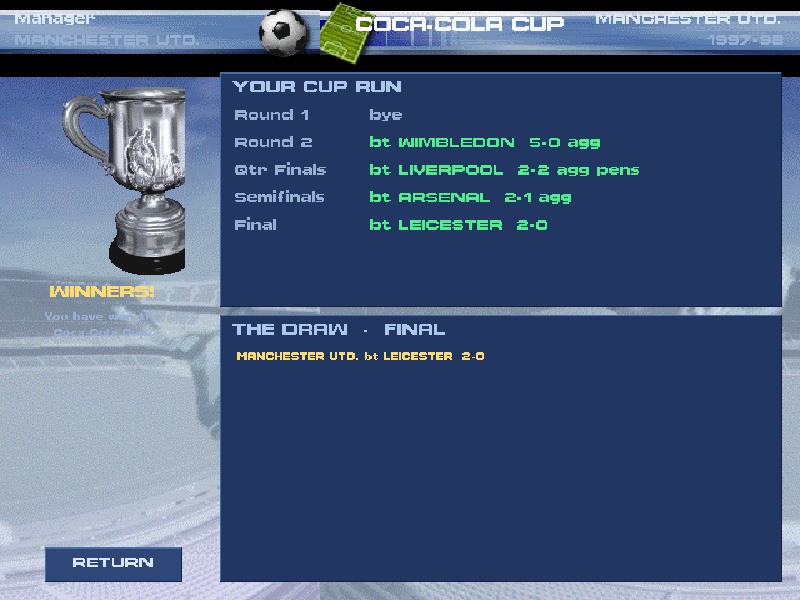

**The Charity Shield** — the season's curtain-raiser, last season's champions v F.A. Cup
winners around the game's own shield art. Captured from the running build:

  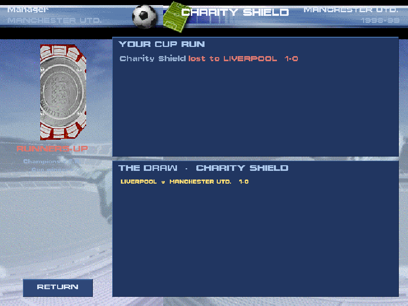

**European competitions** — qualify from last season's finish into the European Cup, the
U.E.F.A. Cup or the Cup Winners' Cup: two-legged knockouts against strong foreign clubs,
each around its own original trophy, with the reversed UEFA prize money. Captured from the
running build (the manager's Cup Winners' Cup run):

  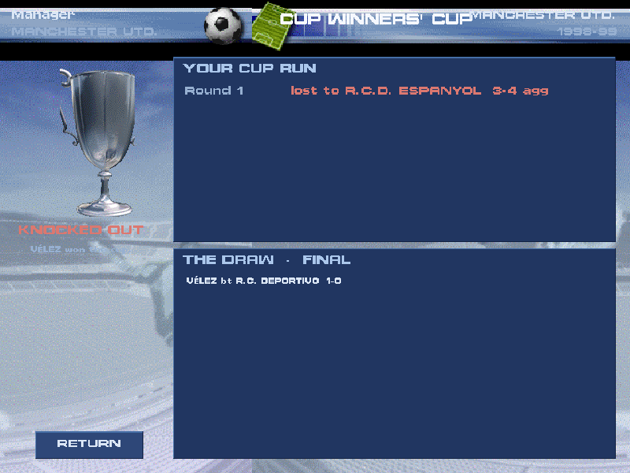

The database and the new-career club picker, all in PM98 chrome (the green data-browser
is gone), captured from the running build:

  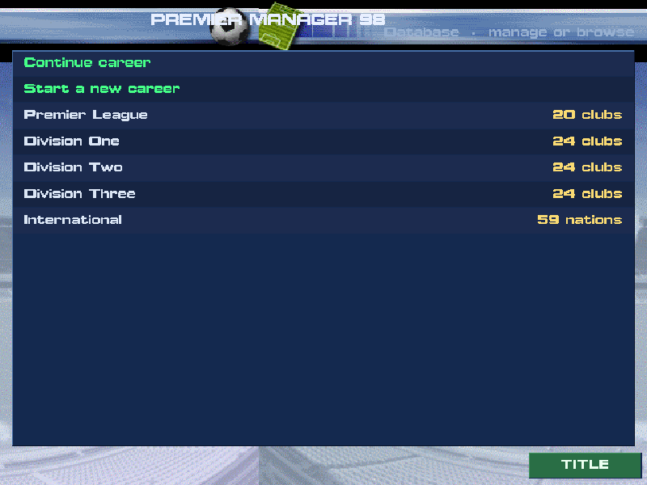
  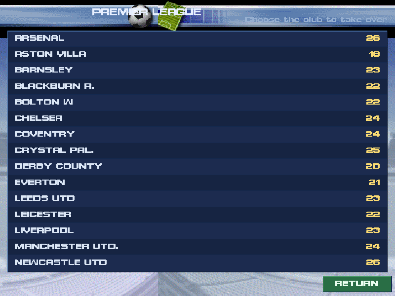
  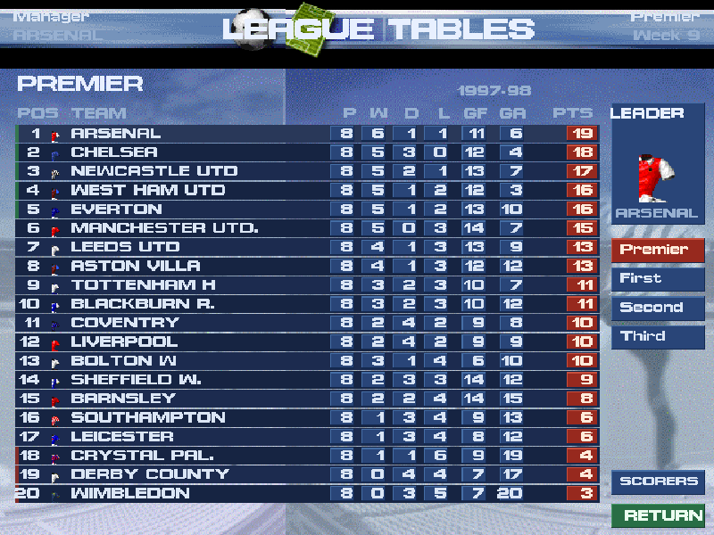

The rest of the rebuilt screens, reconstructed at the exact pixel coordinates reversed
out of the game's executable, from its own icons, fonts and backgrounds:

  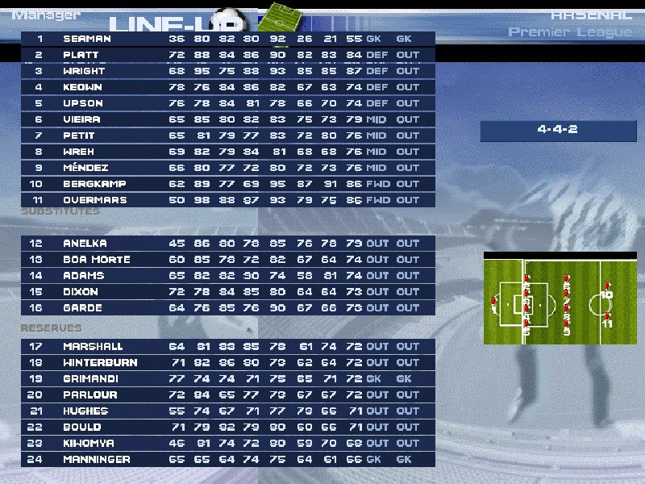
  
  

  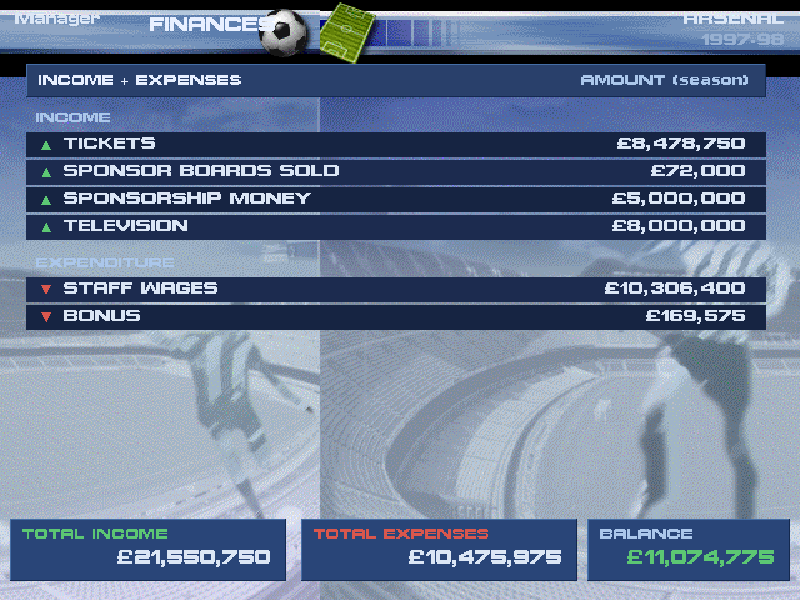
  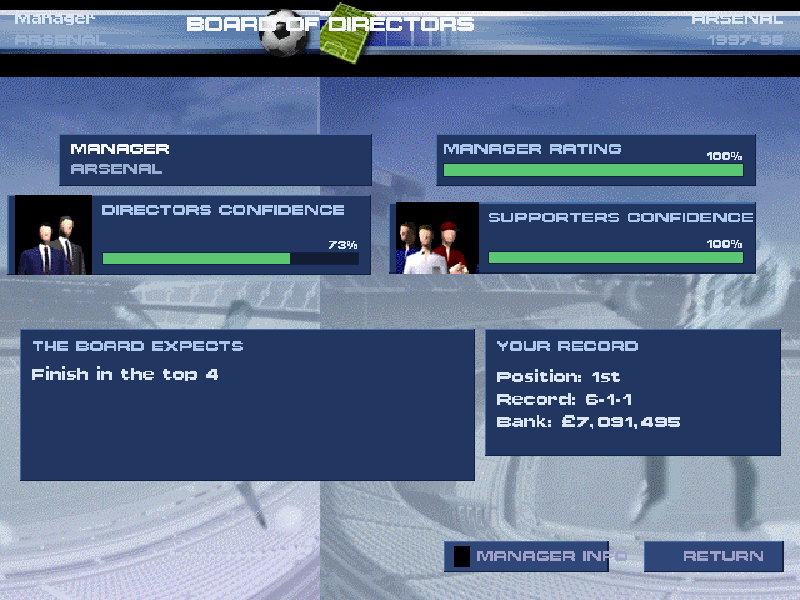
  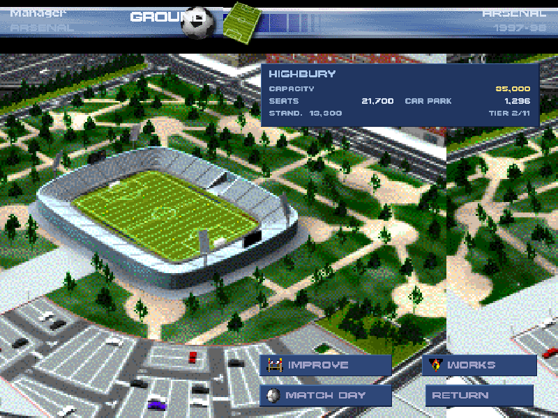

Every screenshot here is a real capture from the running Godot build (Xvfb + GL in CI) —
not a mock-up or a preview render. On a phone each screen runs in landscape with a marble
bezel in the side margins.

## Status

This is an early build, but the whole front end is now PREMIER MANAGER 98, not a green
placeholder UI: it opens on the original title screen, the career hub is the original
Main Menu, and the database browse, the new-career club/league pickers and the
2D match view all run in the game's own chrome (marble background, the BARRA bar, the
PROMAN font), routing into the reversed Squad, League Tables and Finances screens. A
couple of deep menus (team tactics, the transfer desk) are still a simpler functional UI.

## Coming next

The stadium works/expansion sub-view and the full position model (injuries, suspensions,
the club news feed, training/player development, the youth team, the backroom staff,
player contracts and wages, European competitions and BOTH domestic cups — the F.A. Cup and
the Coca-Cola Cup — are now in). The 2D
match view now renders the original game's own sprites on a 3/4 broadcast pitch (the
`.PGF` sprite format is fully cracked, see `docs/re/match_view_re.md`); next for it are
the original scrolling tile-camera and per-team kit recolours. Club crests and player
photos are decoded from the game files (the archive format is cracked, see
`docs/re/pkf_format.md`) and are being wired in. The season simulation uses the
original game's verified random-number generator and a per-shot model tuned to
realistic football results.

## Built with

Godot 4 (GDScript); the APK is built in GitHub Actions. The `tools/` folder holds
the Python that decodes the original game files into the database the app ships
with, and `docs/` documents the file formats.
