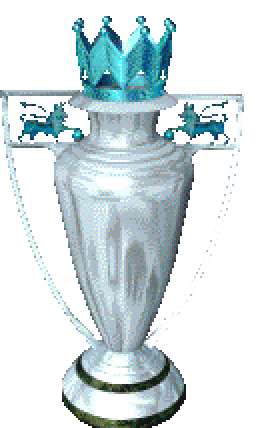
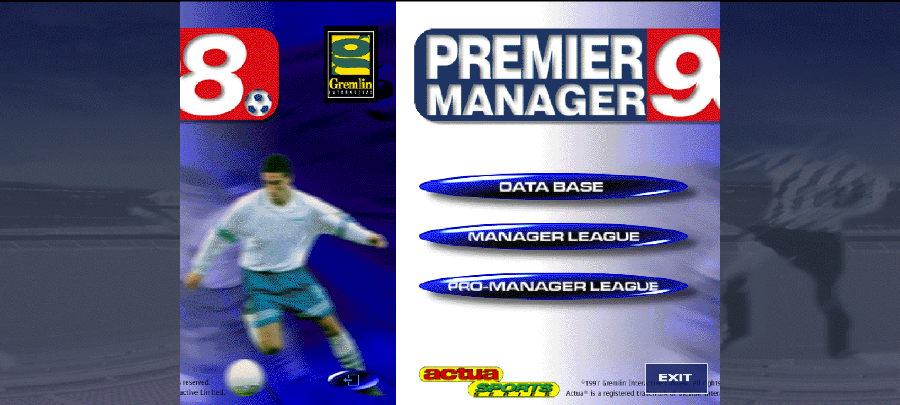
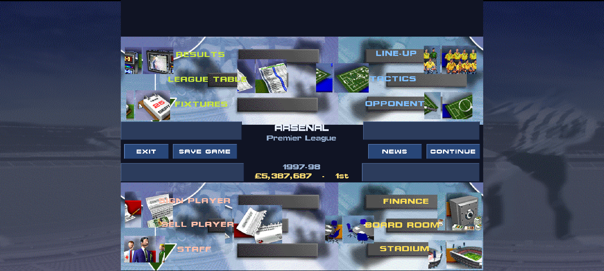
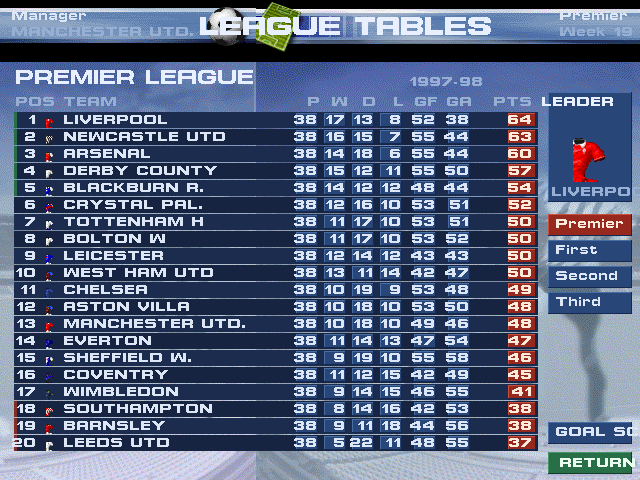
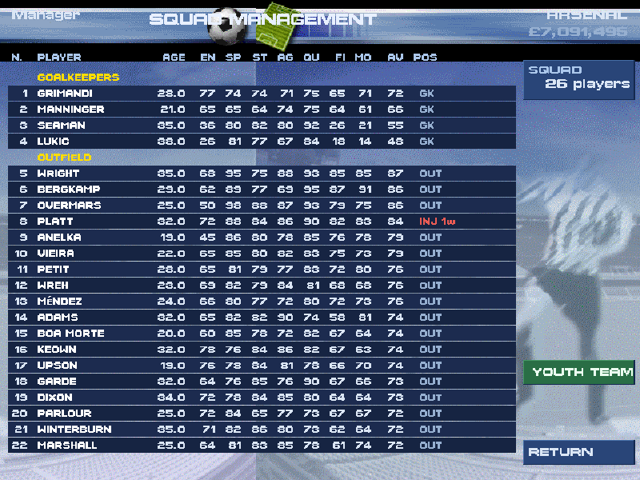
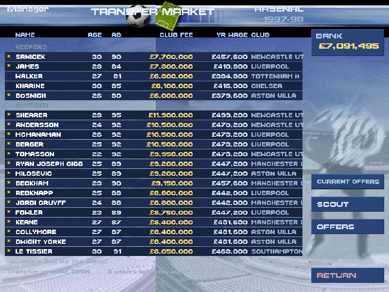
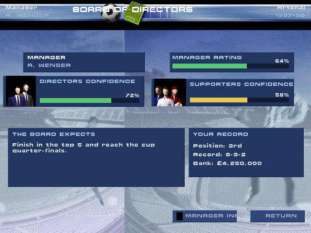
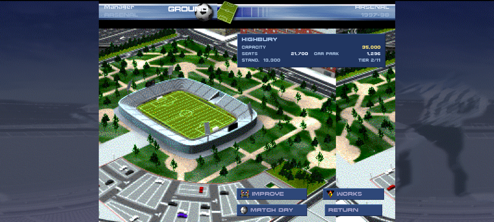

# PM98

An Android remake of **Premier Manager 98**, rebuilt from the original game's own
data. Take over a club, build your squad, run the season.

> **Early build, now playable.** Pick a club and play a career week-by-week with
> save/load, line-up and tactics, and a transfer market, alongside the original
> management screens rebuilt pixel-for-pixel from the game's own art.

The trophy above is decoded straight from the original game's archives by
`tools/re/pkf_image.py` (see the reverse-engineering notes in `docs/re/`). Original
game art © Dinamic Multimedia; shown here for this non-commercial fan remake.

## Download

📦 **[Download the latest APK](https://github.com/Matswm86/pm98-android/releases/download/latest/pm98.apk)**
&nbsp;·&nbsp; [all releases](https://github.com/Matswm86/pm98-android/releases)

Open the link on your phone, tap the APK, allow "install from this source" if
prompted. Reinstalling over an older build? Uninstall the old one first.

## What's in it now

- The full English pyramid: Premier League + Divisions One, Two and Three
  (92 clubs), as the original 1997-98 database has them.
- 384 more clubs from leagues across Europe and South America.
- ~8,000 players with their original ratings, keepers and squads as shipped.
- Browse League → Club → Squad → Player, with each player's attributes.
- Simulate a full season from any English division: every fixture played from the
  real squads, with a final table (form, goal difference, promotion/relegation).
- **Play a career:** take over a club and go week-by-week, with autosave/load,
  the league standings, fixtures and your board objective.
- **Team selection & tactics:** choose your XI on the pitch, pick a formation,
  marking and set-piece takers, all fed into the match engine.
- **Transfer market:** buy and sell players (valued from their real ratings),
  with AI clubs bidding back.
- **Watch a match:** a minute-by-minute commentary feed (goals, cards, saves,
  corners) using the original game's own English match text, with real scorers.
- **Club finances:** income and expenses over a 52-week season, structured on the
  original game's finance ledger (tickets, TV, sponsors, wages).
- **The original screens, rebuilt:** the Title / front-door menu, the Main Menu hub,
  League Tables, Line-Up, Squad, Finances, Transfer Market, the Board of Directors and
  the Stadium are reconstructed at the exact pixel coordinates reversed out of the
  game's executable, using its own icons, fonts and backgrounds (see `docs/re/`). The
  app opens on the real PREMIER MANAGER 98 title screen. Runs in landscape, scaled to
  fit any phone.

## Screenshots

The app on a phone-aspect screen, opening on the original PREMIER MANAGER 98 title,
captured from the running game (not a mock-up):

The Title and the original Main Menu as the live career hub (here managing ARSENAL),
captured from the actual Godot build:

  
  

The rest of the rebuilt screens, reconstructed at the exact pixel coordinates reversed
out of the game's executable, from its own icons, fonts and backgrounds:

  
  
  

  
  
  
  

The first three are real captures from the Godot build (Xvfb + GL in CI). The
remaining six are reference renders from the reconstruction renderers
(`tools/re/preview_*.py`), which mirror each rebuilt scene pixel-for-pixel from the same
coordinates and assets the in-engine screens use; real captures of those are being added.
On a phone each screen runs in landscape with a marble bezel in the side margins.

## Status

This is an early build. It opens on the original title screen, and **the career hub is
now the original PREMIER MANAGER 98 Main Menu**: take over a club and you land on the
real menu, with its icons routing to each rebuilt screen and CONTINUE playing the week.
Some deeper flows (picking a club, team tactics, the transfer desk and the match feed)
still use a simpler functional UI; replacing those with original art is the next
direction.

## Coming next

Original art for the remaining flows (club/league select, transfers, the match feed),
then training, the cups and Europe, injuries and suspensions, and player contracts. Club crests, player photos and a 2D
match view are decoded from the game files (the archive format is fully cracked, see
`docs/re/pkf_format.md`) and are being wired in. The season simulation uses the
original game's verified random-number generator and a per-shot model tuned to
realistic football results.

## Built with

Godot 4 (GDScript); the APK is built in GitHub Actions. The `tools/` folder holds
the Python that decodes the original game files into the database the app ships
with, and `docs/` documents the file formats.
