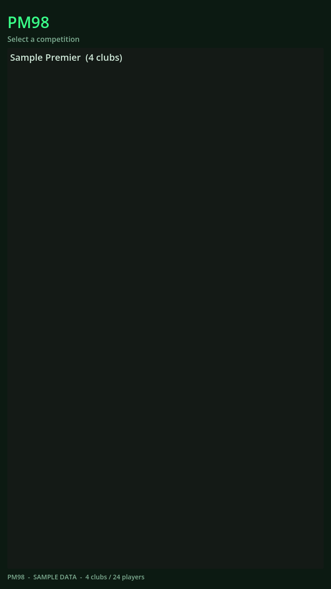
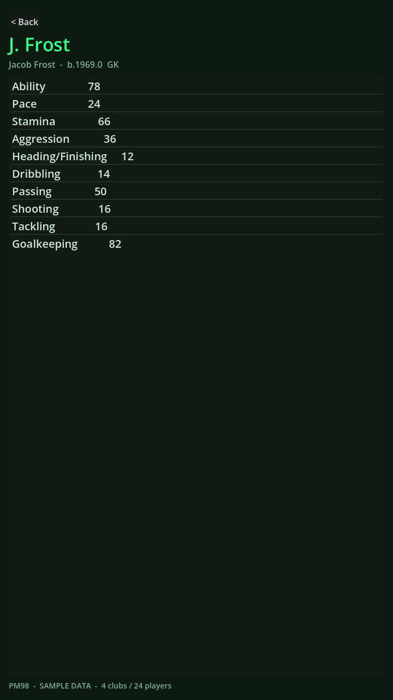

# PM98

An Android remake of **Premier Manager 98**, rebuilt from the original game's own
data. Take over a club, build your squad, run the season.

> **Early build.** You can browse the complete original database right now: every
> league, club and player from the 1997-98 season. The match engine and the rest
> of the management layer are in progress.

## Download

📦 **[Download the latest APK](https://github.com/Matswm86/pm98-android/releases/download/latest/pm98.apk)**
&nbsp;·&nbsp; [all releases](https://github.com/Matswm86/pm98-android/releases)

Open the link on your phone, tap the APK, allow "install from this source" if
prompted. Reinstalling over an older build? Uninstall the old one first.

## What's in it now

- The full English pyramid: Premier League + Divisions One, Two and Three
  (92 clubs), as the original 1997-98 database has them.
- 384 more clubs from leagues across Europe and South America.
- ~8,000 players with their original ratings, keepers and squads as shipped.
- Browse League → Club → Squad → Player, with each player's attributes.

## Screenshots

  
  
  

## Coming next

Club crests, player photos and the original music are already decoded from the
game files and are being wired into the app, then the match engine and a full
playable season.

## Built with

Godot 4 (GDScript); the APK is built in GitHub Actions. The `tools/` folder holds
the Python that decodes the original game files into the database the app ships
with, and `docs/` documents the file formats.
