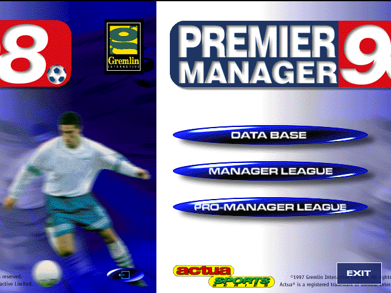
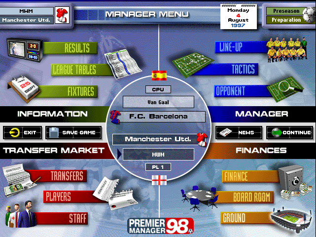
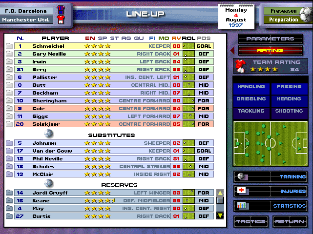

# PM98

An Android remake of **Premier Manager 98**, rebuilt from the original game's own
data. Take over a club, build your squad, run the season.

> **Early build, now playable.** Pick a club and play a career week-by-week with
> save/load, line-up and tactics, and a transfer market, alongside the original
> management screens rebuilt pixel-for-pixel from the game's own art.

The menu above is a real capture from the running build: the original game's own front-door
art and fonts, rebuilt pixel-for-pixel from the game's own resources (see the reverse-engineering
notes in `docs/re/`). Original game art © Dinamic Multimedia; shown here for this non-commercial
fan remake.

## Download

📦 **[Download the latest APK](https://github.com/Matswm86/pm98-android/releases/download/latest/pm98-4d4c91b.apk)** — one tap downloads `pm98-4d4c91b.apk` (current build) straight to your phone.

> **This build (2026-07-24)** fixes six things you told us were wrong, each one settled against the original game rather than guessed:
>
> - **New signings now show up in TRAINING.** The original scrolls each section of the training grid; we were cutting it off at the visible rows, and since a new man joins the end of the squad he was always the one that vanished. Every section has its working scrollbar now.
> - **TACTICS → ROLE is a real picker.** Tap the arrow beside a player's POS and you get the game's own list of all eighteen roles, with **his natural role in gold and the other roles he can genuinely play in white** — a left back who can also fill in at right back, a centre half who can drop into midfield. Those alternatives are not our invention: they are stored per player in the original database, and the popup is the original's own screen down to the pixel.
> - **The staff market refreshes every week.** Three new candidates for every job each week, with a fresh spread of star ratings — so five-star coaches and physios actually turn up instead of the same three names for ever.
> - **You can heal an injured player.** The **+** button on the INJURIES row sends him to the physiotherapist: a five-star physio halves his time out, a weaker one takes a smaller bite, and how many men he can treat at once is his own "N PLAYERS" figure.
> - **Selling works.** Tapping an offer really does flip REFUSE to ACCEPT now — on a phone the tap was being counted twice and cancelling itself, and offers below the first row could not be hit at all.
> - **Bidding is not a marathon.** A player already on the transfer market opens with the asking price, his wage and his contract already filled in, exactly as the original does, instead of starting from £5,000.

> Filenames change every build (`pm98-<commit>.apk`) on purpose, so your phone/browser can never serve a stale cached APK. If a newer build has landed and the direct link above 404s, grab the newest `pm98-*.apk` asset from the **[latest release page](https://github.com/Matswm86/pm98-android/releases/tag/latest)**.

&nbsp;·&nbsp; [all releases](https://github.com/Matswm86/pm98-android/releases)

Open the link on your phone, tap the APK, allow "install from this source" if
prompted. Reinstalling over an older build? Uninstall the old one first.

## What's in it now

- The full English pyramid: Premier League + Divisions One, Two and Three
  (92 clubs), as the original 1997-98 database has them.
- 384 more clubs from leagues across Europe and South America.
- ~8,000 players with their original ratings, keepers and squads as shipped.
- Browse League → Club → Squad → Player, with each player's attributes.
- Simulate a full season from any English division: every fixture played from the
  real squads, with a final table (form, goal difference, promotion/relegation).
- **Play a career:** take over a club and go week-by-week, with autosave/load,
  the league standings, fixtures and your board objective.
- **Team selection & tactics:** choose your XI on the pitch, pick a formation,
  marking and set-piece takers, all fed into the match engine.
- **Transfer market:** buy and sell players (valued from their real ratings),
  with AI clubs bidding back.
- **Injuries & suspensions:** your players pick up knocks and bookings as they
  play, sit out while they recover, and come back. An injured or suspended player
  can't be selected, so the XI reshuffles and the side is weaker until he returns.
  Five bookings earn a one-match ban; reds sit a player down on the spot.
- **Club news:** a live feed of injuries, suspensions, returns to fitness and the
  weekly result, newest first and colour-coded, on the original Main Menu's NEWS.
- **Training & player development:** your players improve or decline over a season
  by age (youngsters climb, veterans fade), and training **intensity** is the lever:
  harder training develops them faster but risks more injuries. Squads age a year
  each season, so a career has a real arc.
- **The youth team:** an academy of young prospects develops on its own track, each with
  a projected **potential** (the ceiling he can reach). When the youth manager judges one
  ready, he's flagged on the YOUTH TEAM screen and you **promote** him into the first-team
  squad. A fresh crop is scouted in every season; youngsters who never make the grade move
  on. Reached from the SQUAD screen's YOUTH TEAM button.
- **The backroom staff:** hire and sack a **TRAINER** (speeds player development), a
  **PHYSIOTHERAPIST** (cuts injury risk) and a **YOUTH COACH** (improves the academy) from
  a pool of available staff, each with a quality rating and a wage. The wage bill comes out
  of the bank every week, and the STAFF screen shows the live effect of your team on all
  three systems. On the Main Menu's EMPLE (staff) icon.
- **The domestic cups:** the **F.A. Cup** and the **Coca-Cola (League) Cup** both run
  alongside the league, with a fresh open draw each round (as the real cups do) and
  prize money for every round you survive plus a bonus for lifting one. The F.A. Cup is
  single-leg with replays then penalties (Round 4 → Round 5 → Qtr. Finals → Semifinals →
  Final); the League Cup is **two-legged** (home and away, settled on aggregate then
  penalties) with a single-leg final (Round 1 → Round 2 → Qtr Finals → Semifinals →
  Final). Track each run on its own original cup screen, around the game's own trophy art.
- **The Charity Shield:** each new season opens with the curtain-raiser between last
  season's **league champions** and **F.A. Cup winners** (the league runners-up step up if
  one club did the Double), a single neutral-venue match settled on penalties if level,
  around the game's own Charity Shield art.
- **European competitions:** finish high and you qualify for Europe the next season,
  the same way the original does: the **European Cup** (champions), the **U.E.F.A. Cup**
  (runners-up) and the **Cup Winners' Cup** (F.A. Cup winners). Each is a two-legged
  knockout (home and away, settled on aggregate then penalties) against a field of strong
  foreign clubs from the game's own database, with prize money on the reversed **UEFA
  schedule** (1M to compete, 510k a win, bonuses for reaching the last 8 and last 4), and
  its own original trophy. Watch every competition through to its final even when you're
  not in it.
- **The winners-of-winners finals:** each new season also opens the **European Supercup**
  (last season's European Cup winners v Cup Winners' Cup winners) and the **Intercontinental
  Cup** (European Cup winners v the South American champions), one-off matches around their
  own original trophies.
- **Watch a match:** the original's in-match **MATCH OPTIONS** view picker
  (WATCH / HIGHLIGHTS / BRIEF / RESULTS, at the exact button coordinates reversed
  from the executable). **BRIEF** is a minute-by-minute commentary feed (goals,
  cards, saves, corners) in the game's own English match text with real scorers;
  **WATCH** is the **2D graphic simulador** — a side-on stadium built from the
  game's own sprites (players, ball, the PREMIER MANAGER 98 / actua Sports boards,
  crowd, grass and sky), animated over the very same match timeline so the two
  views always agree on the scoreline. (HIGHLIGHTS' 3D engine is CD-only data
  absent from the archive.)
- **Club finances:** income and expenses over a 52-week season, structured on the
  original game's finance ledger (tickets, TV, sponsors, wages).
- **The original screens, rebuilt:** the Title / front-door menu, the Main Menu hub,
  League Tables, Line-Up, Squad, Finances, Transfer Market, the Board of Directors and
  the Stadium are reconstructed at the exact pixel coordinates reversed out of the
  game's executable, using its own icons, fonts and backgrounds (see `docs/re/`). The
  app opens on the real PREMIER MANAGER 98 title screen. Runs in landscape, scaled to
  fit any phone.

## Screenshots

The career hub (the original Main Menu, running a season) and the LINE-UP screen with the
squad, formation and pitch:

  
  

PREMIER MANAGER 98, the game this build rebuilds screen-for-screen from the original's
own icons, fonts and backgrounds (the reverse-engineering notes are in `docs/re/`). Original
game © Dinamic Multimedia / Gremlin; shown here for this non-commercial fan remake. On a phone
each screen runs in landscape with a marble bezel in the side margins.

## Status

This is an early build, but the whole front end is now PREMIER MANAGER 98, not a green
placeholder UI: it opens on the original title screen, the career hub is the original
Main Menu, and the database browse, the new-career club/league pickers and the
2D match view all run in the game's own chrome (marble background, the BARRA bar, the
PROMAN font), routing into the reversed Squad, League Tables and Finances screens. A
couple of deep menus (team tactics, the transfer desk) are still a simpler functional UI.

## Coming next

The stadium works/expansion sub-view and the full position model (injuries, suspensions,
the club news feed, training/player development, the youth team, the backroom staff,
player contracts and wages, European competitions and BOTH domestic cups — the F.A. Cup and
the Coca-Cola Cup — are now in). The 2D
match view now renders the original game's own sprites on a 3/4 broadcast pitch (the
`.PGF` sprite format is fully cracked, see `docs/re/match_view_re.md`); next for it are
the original scrolling tile-camera and per-team kit recolours. Club crests and player
photos are decoded from the game files (the archive format is cracked, see
`docs/re/pkf_format.md`) and are being wired in. The season simulation uses the
original game's verified random-number generator and a per-shot model tuned to
realistic football results.

## Built with

Godot 4 (GDScript); the APK is built in GitHub Actions. The `tools/` folder holds
the Python that decodes the original game files into the database the app ships
with, and `docs/` documents the file formats.
